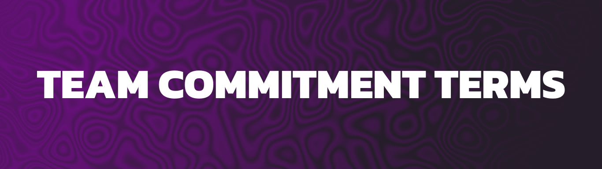
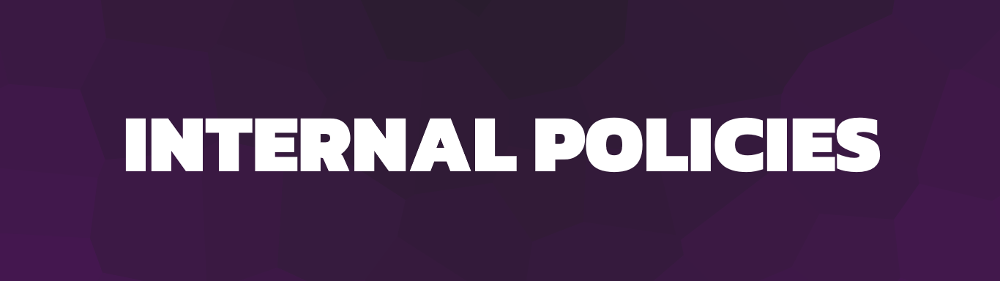
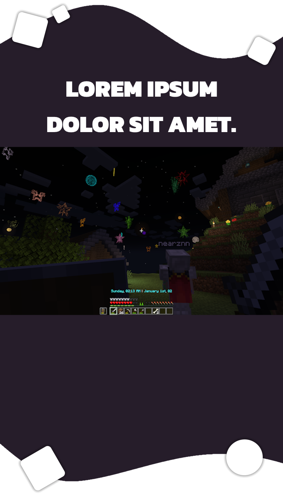
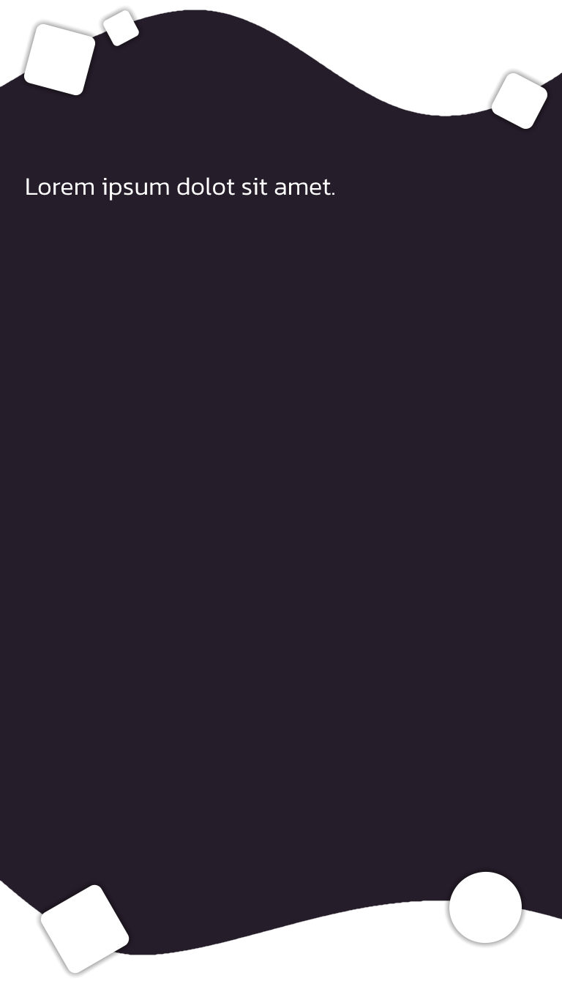
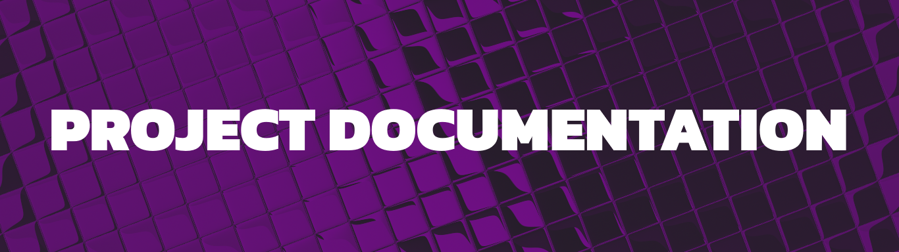
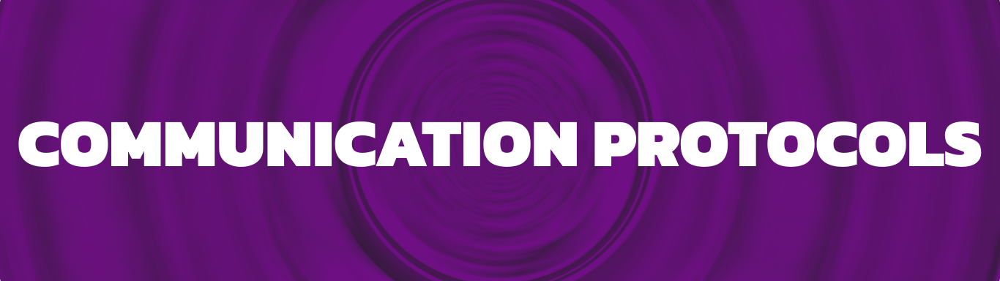

<head>
  <link rel="stylesheet" href="styles.css"/>
</head>

Kyubion Studios, herein referred to as "the Organization," is a content development team specializing in Minecraft gameplay enhancements. Our primary objective is to cultivate a large and engaged community by creating diverse mods, datapacks, resource packs, and, furthermore, through the establishment of our forthcoming Arkyon minecraft server.

In order to maintain a seamless workflow within the team, it is imperative to establish definitive guidelines that facilitate optimal comprehension among team members. Presented herewith are the potentially exhaustive documentations deemed essential to enhance the team's understanding:

A comprehensive document outlining the contractual agreement between Kyubion Studios and its team members. By continuing as a member of our team, you acknowledge that you have read, understood, and agreed to these terms. Failure to comply may result in disciplinary action, including expulsion from the team.

### Multi-Factor Authentication (MFA)

All team members are required to enable Multi-Factor Authentication (MFA) on any account with high-risk permissions on any social platform. Kyubion Studios shall not be held responsible for any loss of accounts that may occur due to MFA activation.

### Financial Responsibility

Kyubion Studios is unable to provide refunds for any team members.

### Confidentiality Agreement

Members agree not to disclose any internal information, download, or share links with external users without prior authorization from Kyubion Studios.

### False Information Policy

Any team member found to have provided false information in previous applications will be permanently barred from the team.

### Activity Requirement

All team members are encouraged to engage periodically and contribute to the team's efforts, as per their role and availability. While some roles may not necessitate frequent activity, everyone's participation and input is evaluated.

### Amendments to Terms

Kyubion Studios reserves the right to amend these terms at any time. Any changes will be communicated to team members through the team's communication channels.

> If you have any questions or concerns regarding these terms, please contact the COO for clarification.

A structured set of guidelines governing the conduct, responsibilities, and operational protocols pertinent to Kyubion Studios' team members. These policies aim to streamline workflow, ensure accountability, and promote harmonious collaboration within the team.

# Teams

Kyubion Studios teams are organized into distinct segments:

1. **Departments:** These are specific sectors within Kyubion Studios that handle different aspects or interests of the organization.
2. **Divisions:** Each department is further subdivided into groups, with each group focusing on a particular area within that department.
3. **Positions:** Within the divisions, positions are assigned to employees, who carry out their duties based on the defined roles and responsibilities.

## Hierarchy

- ### Management

  - #### Office
    - <strong style="color:#580000">Chief Executive Officer</strong>: Oversees strategic direction and overall management of the organization.
    - <strong style="color:#d82323">Chief Operating Officer</strong>: Responsible for day-to-day operations and organizational efficiency.
    - <strong style="color:#ff5959">Chief Development Officer</strong>: Leads the development and implementation of the organization's projects and initiatives.
  - Human Resources
    - <strong style="color:#bd6b00">Human Resources Manager</strong>: Manages human resources policies, procedures, and employee relations.
    - <strong style="color:#ffaf00">Job Analyst</strong>: Analyzes job requirements and develops job descriptions.
    - <strong style="color:#ffb320">Recruiter</strong>: Recruits, interviews, and selects qualified candidates for employment.

- ### Development

  - #### Technical
    - <strong style="color:#006d00">Senior Developer</strong>: Leads technical development efforts and provides guidance to developers.
    - <strong style="color:#4bb34b">Developer</strong>: Designs, codes, and implements software solutions.
  - #### Artistic
    - <strong style="color:#00ff0b">Creative Director</strong>: Sets creative vision and leads the artistic team.
    - **Pixel Artist:** Creates pixel art assets for mods.
    - **3D Modeler:** Designs and creates 3D models for game item, blocks and entities.
  - #### Gameplay
    - <strong style="color:#00bba7">Builder</strong>: Constructs in-game environments and structures.
  - #### Quality Assurance
    - <strong style="color:#007ae2">Quality Assurance Supervisor</strong>: Oversees quality assurance processes and teams.
    - <strong style="color:#68c6ff">Content Quality Tester</strong>: Tests projects features to ensure quality and functionality.

- ### Community
  - #### Interaction
    - <strong style="color:#00053b">Community Manager</strong>: Engages with the community, organizes events, and manages social media channels.
  - #### Moderation
    - <strong style="color:#2d5aff">Feedback Manager</strong>: Collects, analyzes, and responds to community feedback.
    - <strong style="color:#5e5edb">Moderator</strong>: Monitors and moderates online community platforms.
  - #### Support
    - <strong style="color:#9938ff">Support Manager</strong>: Manages user support operations and ensures timely resolution of issues.
    - <strong style="color:#9d77d3">Support Agent</strong>: Provides assistance and support to users.
  - #### Contributors
    - <strong style="color:#ff30e4">Project Contributor</strong>: Contributes to the development of our projects.
    - <strong style="color:#ca1697"> Community Contributor</strong>: Contributes to the community through various means such as content creation or engagement activities.

Detailed documentation pertaining to ongoing and prospective projects undertaken by Kyubion Studios. This includes project briefs, specifications, milestones, and timelines, providing clarity regarding project objectives, requirements, and progress tracking.

Established protocols delineating the preferred modes of communication, frequency of updates, and channels for inter-team correspondence. These protocols aim to facilitate effective communication, minimize misunderstandings, and foster a cohesive team environment.

---
By adhering to these documented guidelines, Kyubion Studios endeavors to optimize team efficiency, foster clarity, and uphold professional standards in pursuit of our shared goals.