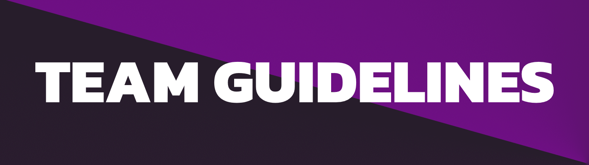

# 
This is Kyubion Studios! Your destination for unique and innovative Minecraft content. 

## Who We Are

Kyubion Studios is a creative powerhouse dedicated to crafting a wide range of Minecraft content, including Mods, Modpacks, Datapacks, Resourcepacks, and our minecraft server: Arkyon; All with unconventional and fresh themes. Our mission is to push the boundaries of creativity within the Minecraft community, offering projects with features and concepts that have never been seen before.

## What We Do

At Kyubion Studios, we pride ourselves on bringing never-before-seen content to the Minecraft universe. We constantly innovate with projects that break away from traditional conventions, ensuring that each creation offers something new and exciting for our users.

## Our Approach

We believe in maintaining a friendly and approachable demeanor with our users. While we take our projects seriously, we also strive to create a welcoming atmosphere without resorting to exaggerated enthusiasm or artificial cheerfulness.

## Our Vision

Our vision is to become a leading source of groundbreaking Minecraft content, releasing new projects regularly while maintaining a high standard of quality and innovation.

# 

Kyubion Studios is dedicated to fostering creativity and collaboration among its members. Teams within the organization work on various projects to achieve our shared goals.

### Objectives

Our objectives are multifaceted, aiming to both create high-quality projects and foster the personal growth and development of our members. We aspire to:

- Foster creativity and out-of-the-box thinking in all our projects.
- Ensure quality and care at every stage of development, from conception to final delivery.
- Cultivate an inclusive and collaborative environment where all members have a voice and contribute to collective success.
- Maintain a friendly and welcoming approach in our interactions with users and followers of our projects.
- Overcome challenges and obstacles with resilience and determination, constantly seeking improvements and creative solutions.

### Core Principles

At the organization, we uphold certain core principles that guide our work:

- Creativity: We continuously seek original and innovative ideas, challenging the status quo and exploring new possibilities.
- Quality: We commit to delivering high-quality projects, with attention to detail and care in every aspect.
- Collaboration: We value collaboration and teamwork, recognizing that each member brings unique and valuable skills to the creative process.
- Respect: We maintain an environment of mutual respect, where all opinions are heard and considered seriously.
- Equity: We ensure that all members are treated fairly and equitably, regardless of their position or experience.

# 

By continuing as a member of the organization, you acknowledge that you have read, understood, and agreed to these guidelines. Failure to comply may result in disciplinary action, including expulsion from the team.

## Extra Account Security (MFA)
We suggest everyone turn on Multi-Factor Authentication (MFA) for any accounts that have dangerous permissions on social platforms. This extra step helps keep your accounts safe and sound.
*MFA adds a layer of security by asking for extra verification beyond just a password. It helps keep sensitive info secure and reduces the risk of unauthorized access.*

## Voluntary Participation
As of April 2024, We can't offer payment to team members.
*Everyone here is a volunteer, so please don't expect to get paid.*

## Keeping Things Private
Please don't share any internal info or links with anyone outside the team without permission.
*Keeping things confidential is super important to protect our sensitive info. By following this, you're helping keep our team's privacy and security intact.*

## Honesty is Important
If anyone gives false information in their application, they won't be able to stay on the team. Honesty and integrity are really important to us.

## Stay Active and Involved
We encourage everyone to stay involved and contribute to the team as much as they can, according to their role and availability.
*This means it's important to actively participate and help out the team, to make sure our project is a success! :D*

## Positions Limitation
To apply for a specific position, you must fill out the application form during the designated period. Even if you're already part of the team, we can't assign you a role just because you requested it.
*This ensures that all applicants are evaluated equally and fairly when positions become available, promoting fairness and equal opportunity for all members.*

## Role Permissions
Team members have the permissions associated with their own role as well as all roles below theirs.
*This policy ensures that team members have the necessary access to perform their duties effectively, while maintaining an organized and hierarchical structure.*

## Updates to Terms
Any changes will be communicated to team members through the team's communication channels.