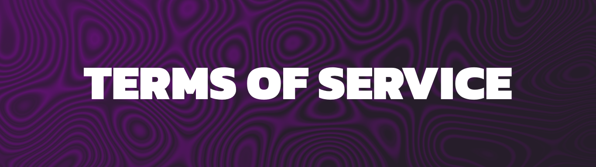

# About

Kyubion Studios, herein referred to as "the Company," is a content development team specializing in Minecraft gameplay enhancements. Our primary objective is to cultivate a large and engaged community by creating diverse mods, datapacks, resource packs, and, furthermore, through the establishment of our forthcoming Arkyon minecraft server.

In order to maintain a seamless workflow within the team, it is imperative to establish definitive guidelines that facilitate optimal comprehension among team members. Presented herewith are the potentially exhaustive documentations deemed essential to enhance the team's understanding:

A comprehensive document outlining the contractual agreement between Kyubion Studios and its community members, delineating rights, obligations, and permissible actions within the realm of the Company's products and services.

A structured set of guidelines governing the conduct, responsibilities, and operational protocols pertinent to Kyubion Studios' team members. These policies aim to streamline workflow, ensure accountability, and promote harmonious collaboration within the team.

Detailed documentation pertaining to ongoing and prospective projects undertaken by Kyubion Studios. This includes project briefs, specifications, milestones, and timelines, providing clarity regarding project objectives, requirements, and progress tracking.

Established protocols delineating the preferred modes of communication, frequency of updates, and channels for inter-team correspondence. These protocols aim to facilitate effective communication, minimize misunderstandings, and foster a cohesive team environment.

***
By adhering to these documented guidelines, Kyubion Studios endeavors to optimize team efficiency, foster clarity, and uphold professional standards in pursuit of our shared goals.

# Positions
At Kyubion Studios, the team is organized into three distinct segments:

## Departments
These are specific sectors within Kyubion Studios that handle different aspects or interests of the company.

## Divisions
Each department is further subdivided into groups, with each group focusing on a particular area within that department.

## Positions
Within the divisions, positions are assigned to employees, who carry out their duties based on the defined roles and responsibilities.

# Hierarchy
> The hierarchy at Kyubion Studios is structured as follows:
> - ### *Department*
>   - #### *Division*
>     - *Position*

- ### Management
  - #### Office
    - Chief Executive Officer
    > Oversees strategic direction and overall management of the company.
    - Chief Operating Officer
    > Responsible for day-to-day operations and organizational efficiency.
    - Chief Development Officer
    > Leads the development and implementation of the company's projects and initiatives.
  - Human Resources
    - Human Resources Manager
    > Manages human resources policies, procedures, and employee relations.
    - Job Analyst
    > Analyzes job requirements and develops job descriptions.
    - Recruiter
    > Recruits, interviews, and selects qualified candidates for employment.

- ### Development
  - #### Technical
    - Senior Developer
    > Leads technical development efforts and provides guidance to developers.
    - Developer
    > Designs, codes, and implements software solutions.
  - #### Artistic
    - Creative Director
    > Sets creative vision and leads the artistic team.
    - Pixel Artist
    > Creates pixel art assets for mods.
    - 3D Modeler
    > Designs and creates 3D models for game item, blocks and entities.
  - #### Gameplay
    - Builder
    > Constructs in-game environments and structures.
  - #### Quality Assurance
    - Quality Assurance Supervisor
    > Oversees quality assurance processes and teams.
    - Content Quality Tester
    > Tests projects features to ensure quality and functionality.

- ### Community
  - #### Interaction
    - Community Manager
    > Engages with the community, organizes events, and manages social media channels.
  - #### Moderation
    - Feedback Manager
    > Collects, analyzes, and responds to community feedback.
    - Moderator
    > Monitors and moderates online community platforms.
  - #### Support
    - Support Manager
    > Manages user support operations and ensures timely resolution of issues.
    - Support Agent
    > Provides assistance and support to users.
  - #### Contributors
    - Project Contributor
    > Contributes to the development of our projects.
    - Community Contributor
    > Contributes to the community through various means such as content creation or engagement activities.